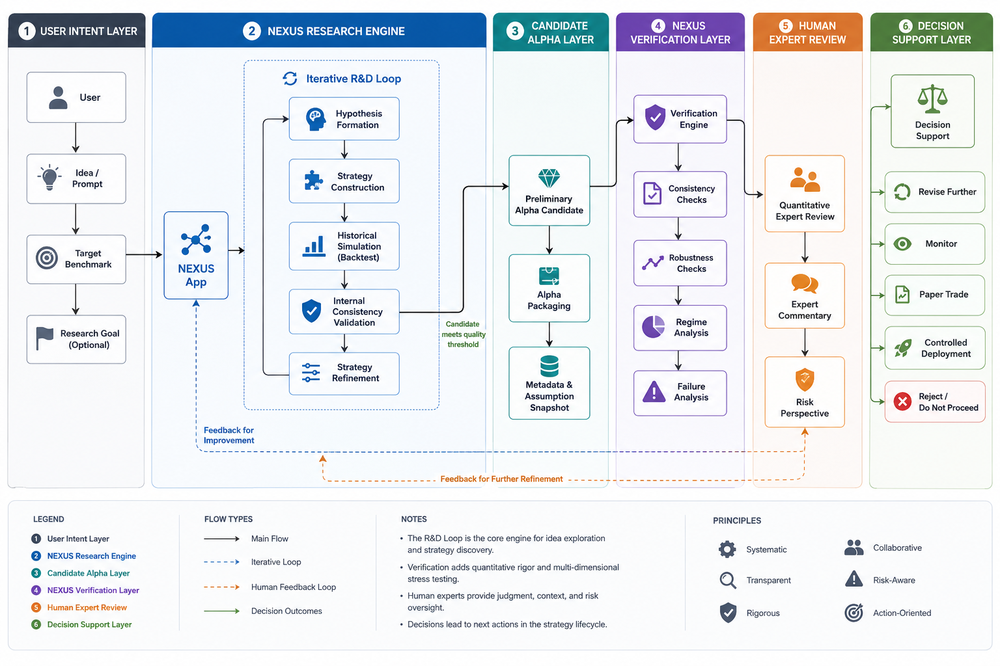
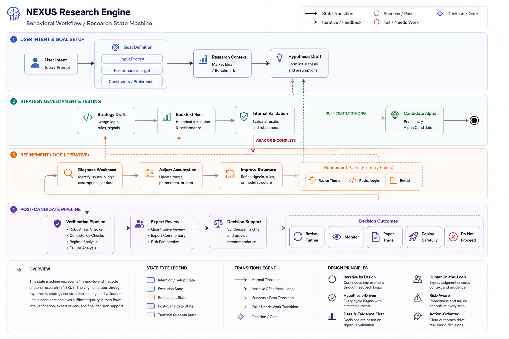
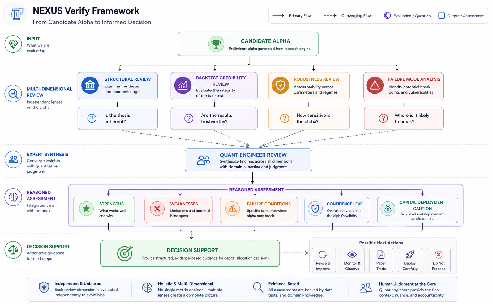

# NEXUS

If you have a trading idea but do not yet know how to turn it into a testable alpha, NEXUS is built for exactly that problem.

You do not need to start with code. You can start with a prompt, a hypothesis, a market view, or a benchmark you want to reach. From there, NEXUS helps move your idea forward into a more structured alpha that has already gone through multiple rounds of research and screening.

At the same time, NEXUS does not stop at alpha generation. An alpha that looks good in backtesting can still fail in live trading. That is why NEXUS also includes a Verify layer to help you understand where that alpha is strong, where it is weak, and whether it is truly ready to move forward.

## Where to start

At the current stage, the main way to use NEXUS is through the desktop application provided by the company.

Download the application here:

- [nexus-desktop_0.1.0_x64-setup.exe](releases/nexus-desktop_0.1.0_x64-setup.exe)

This repository is mainly intended to present the system and store related artifacts. At this stage, it is not yet a repository for end users to pull the full source code and operate the entire system on their own.

## How you use NEXUS

The main entry point to NEXUS is the `.exe` application.

Instead of writing a strategy from scratch, you can provide:

- a prompt
- a trading idea
- a market hypothesis
- a desired performance target or benchmark

From there, the system runs through multiple R&D cycles to gradually form and improve an alpha.

The important point is this: NEXUS is not the kind of tool that takes a prompt and generates one block of code once. It is designed to iterate, evaluate repeatedly, and refine continuously until it produces a more grounded candidate alpha.

## From idea to alpha

At a conceptual level, the process can be understood like this:

`idea -> hypothesis -> strategy -> backtest -> validation -> refinement -> candidate alpha`

That means the system will:

- read the target or benchmark you define
- form a trading hypothesis aligned with that target
- translate the hypothesis into a testable strategy
- run backtests to inspect the results
- discard or revise weaker versions
- repeat until a stronger candidate alpha begins to emerge

Because of that, the output of NEXUS is not just code. What you receive is an alpha that has already gone through internal research and screening.

## Why having an alpha is still not enough

Many alphas look strong in research but do not hold up once they move into live conditions.

If you have ever seen a backtest look good while live performance breaks down, that is exactly the gap NEXUS is trying to address more clearly.

An alpha can fail in practice for many reasons:

- the result is too tightly fitted to historical data
- the strategy structure is not robust when market conditions change
- the number of signals or trades is too small to support statistical confidence
- real drawdowns exceed what you can actually tolerate
- the trading logic looks reasonable on paper but is difficult to sustain in real trading conditions

That is why generating an alpha is only the beginning. What matters next is understanding whether that alpha is robust, where it may break, and under what conditions it may start losing effectiveness.

## What NEXUS Verify helps you do

NEXUS Verify is the review layer that comes after the alpha has been formed.

Its goal is not simply to say `"pass"` or `"fail"`. What you actually need is a reasoned assessment:

- where this alpha is strong
- where this alpha is weak
- under what conditions this alpha may fail
- why an alpha that looks good in research may still be unreliable in live trading

In other words, Verify does not try to make an alpha look better. Verify helps you see it more clearly.

## Why Verify includes quantitative engineers

Not every important issue in an alpha can be judged well through automated checks alone.

The system can support analysis, summarization, and surface areas that deserve attention. But at the deeper review stage, quantitative engineering input matters because you often need answers to questions like:

- is the hypothesis reasonable but too fragile
- do the results look attractive but lack real depth
- does the strategy depend too heavily on one specific market condition
- if the alpha fails, where is that failure most likely to come from

That is why Verify is not only about confirming results. It is about explaining results so you can make better decisions.

## What you receive from NEXUS

When you use NEXUS, the important thing is not how many technical components exist behind the scenes.

What matters more is that you receive:

- a way to move from an idea to an alpha without building the full technical workflow yourself
- a candidate alpha that has already gone through repeated research and internal validation
- a review layer that helps you understand whether that alpha is trustworthy
- a better basis for deciding whether to revise it, monitor it, paper trade it, deploy it live, or stay more cautious with capital allocation

## What the alphas in this repository represent

The `alphas/` directory in this repository is not just there to display files.

`alphas/python/` contains Python alphas used on the research side. They represent strategy logic, candidate alpha structures, and artifacts that are useful for review, refinement, and verification-oriented analysis.

`alphas/mql5/` contains MQL5 alphas that are closer to live trading usage. In the current context, these are not only illustrative outputs. They reflect code that the company has actually used in live operation, which gives them clear practical value.

That means this repository contains artifacts from different stages of the strategy lifecycle, from research-side logic to code that has already been used in a live environment.

## What this repository currently contains

This repository currently stores the materials used for system presentation, demo, and handoff:

- `alphas/python/`: research-side Python alphas
- `alphas/mql5/`: live-trading MQL5 alphas
- `alphas/manifest.json`: alpha inventory and checksums
- `releases/`: desktop installer
- `releases/manifest.json`: installer metadata
- `docs/*.png`: process illustrations

## In short

If you have a trading idea and want to turn it into a more structured alpha, NEXUS is the starting point.

If you already have an alpha and want to know whether it is truly solid enough to move forward, NEXUS Verify is the next review layer.

Within that sequence, the `.exe` application helps you start the R&D process, while Verify helps you understand the alpha's strengths, weaknesses, and credibility before you make more important decisions.
